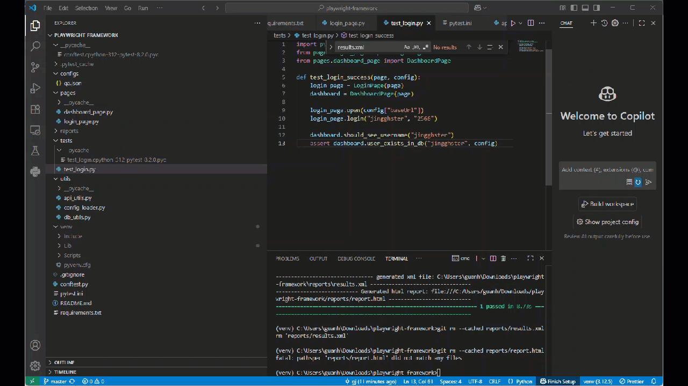

# Playwright POM Automation Framework

This project is an **end-to-end automation framework** using **Playwright + Pytest + Page Object Model (POM)**.  
It demonstrates **UI, API, and DB validation** in one place, with support for multiple environments (qa, staging, prod).  

---

## Features

- **UI testing** with Playwright (auto-waiting, cross-browser)  
- **API testing** with Requests  
- **Database validation** with MySQL connector  
- **Page Object Model (POM)** for maintainable design  
- **Multi-environment support** (`--env=qa/staging/prod`)  
- **Reports**: JUnit XML, pytest-html, Allure, Playwright trace  


---

## Project Structure
```bash
playwright-framework/
│── tests/ # Test suites
│ └── test_login.py # Example: UI + DB validation
│
│── pages/ # Page Object Model (POM)
│ ├── login_page.py # Login page actions
│ └── dashboard_page.py # Dashboard assertions + DB check
│
│── utils/ # Helpers
│ ├── api_utils.py # API requests
│ ├── db_utils.py # DB queries
│ └── config_loader.py # Load env configs
│
│── configs/ # Environment configs
│ ├── qa.json
│ ├── staging.json
│ └── prod.json
│
│── conftest.py # Pytest fixtures (env, page, config)
│── requirements.txt # Python dependencies
│── README.md


```
## Install dependencies

pip install -r requirements.txt

playwright install

## Running Tests

pytest -v --env=qa

pytest --headed

# Locator Comparison Across Frameworks

## Framework Differences

| Framework | Locator methods | Key features | Example |
|-----------|----------------|--------------|---------|
| **Cypress** | `cy.get()`, `cy.contains()`, `cy.xpath()` (via plugin) | Chainable, auto-retry, best with CSS selectors | `cy.get('input[name="username"]')`<br>`cy.contains('Login')` |
| **Robot Framework (SeleniumLibrary/BrowserLibrary)** | Keyword + locator strategy (`id=`, `name=`, `css=`, `xpath=`) | Human-readable, supports multiple locator types | `Input Text    id=username    jingghster`<br>`Click Button   xpath=//button[@id="login"]` |
| **Playwright** | `page.locator()`, `page.get_by_*` | Built-in **strict mode** (unique matches), powerful selector API, auto-waiting | `page.locator('#username').fill('jingghster')`<br>`page.get_by_role("button", name="Login").click()` |

## Example: Fill username + password + click login

### Cypress
```javascript
cy.get('input[name="name"]').type('jingghster')
cy.get('input[name="user_pin"]').type('2566')
cy.contains('Login').click()

```
### Robot Framework
```bash
Input Text    name=username    jingghster
Input Text    name=user_pin    2566
Click Button  xpath=//button[@name="commit"]

```
### Playwright (Python)
```python
page.locator('input[name="name"]').fill("jingghster")
page.locator('input[name="user_pin"]').fill("2566")
page.get_by_role("button", name="commit").click()